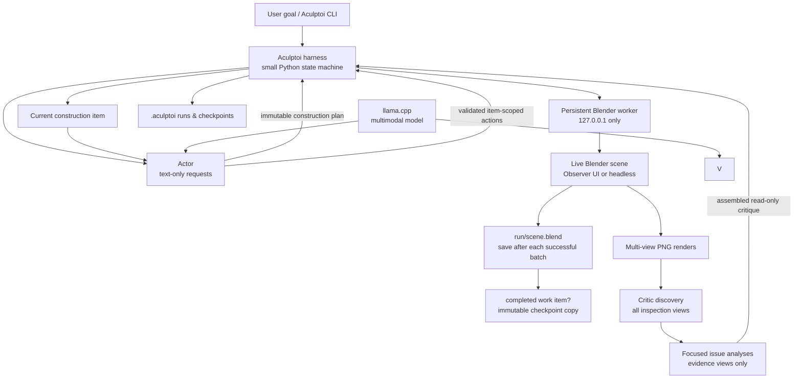

# Aculptoi

**A local-first autonomous 3D agent for Blender.**

> Local AI that sees, builds, and refines in Blender.

Aculptoi can build 3D objects, look at its own work from multiple viewpoints, critique the result using a local multimodal model, and iteratively refine the Blender scene. It is an early-stage, experimental project: V1 establishes the safe, inspectable architecture rather than attempting fully autonomous sculpting.

## Why Aculptoi?

Most 3D agents stop at generating code or issue opaque operations. Aculptoi is designed to close a local feedback loop: an Actor proposes constrained scene changes, a persistent Blender worker performs them, renders provide evidence, and a Vision Critic evaluates the result. Every iteration produces files that a person can inspect.

It is CLI-first, Blender-native, model-agnostic, and local-first. [llama.cpp](https://github.com/ggml-org/llama.cpp)'s OpenAI-compatible server is a first-class target, but any compatible local endpoint can be configured. MCP is not required and is deliberately not in the core architecture.

## Status

V1 is a usable foundation. It includes:

- a typed, allowlisted action language and independent validation at the harness and worker boundaries;
- a persistent localhost-only Blender HTTP worker;
- scene/object inspection, deterministic four-view renders, per-run canonical `.blend` files, durable item checkpoints, and a plan-first Actor → Blender → two-stage vision loop with traced construction items;
- named OpenAI-compatible providers that can be shared by the separate Actor and Vision Critic roles; and
- structured JSON output for operational commands.

It does **not** yet autonomously make sophisticated creatures, offer broad sculpt tooling, or provide an add-on UI. See [the roadmap](#roadmap).

## Architecture



The harness is deliberately a small explicit state machine, not a heavy agent framework:

```text
inspect scene → construction plan artifact → work item → validate/execute → save canonical scene.blend
              → [continue current item or advance] → render views → issue discovery
              → focused issue analyses → assembled critique
```

This separation makes an eventual LangGraph integration, REST service, or MCP adapter additive rather than foundational.

## Quick start

Requirements: Python 3.12+, Blender, and (for `run`) an OpenAI-compatible local multimodal endpoint. One endpoint is the recommended simple setup; separate actor and vision endpoints remain supported. No cloud keys are required.

```bash
git clone https://github.com/ifranlaloe/Aculptoi.git
cd Aculptoi
python3 -m venv .venv
source .venv/bin/activate
python -m pip install --upgrade pip
python -m pip install -e '.[dev]'

# Checks Python, Blender, project access, worker, and configured model providers.
aculptoi doctor

# Opens the same Blender process Aculptoi will control, in Observer Mode.
aculptoi start
# Equivalent explicit form: aculptoi blender start --ui
# Use `aculptoi start --headless` for background automation.
aculptoi scene inspect --json
aculptoi object list --json
```

On macOS the default Blender path is `/Applications/Blender.app/Contents/MacOS/Blender`. On Linux and Windows-compatible shells, set `blender.executable` in `aculptoi.toml` if `blender` is not on `PATH`.

### Local llama.cpp configuration

The recommended setup is one llama.cpp server running a multimodal GGUF with its matching `mmproj` projection. Both roles use that same endpoint and model, but remain separate application roles with distinct system prompts, requests, output schemas, and permissions.

Create `aculptoi.toml` in the project root:

```toml
max_iterations = 5
max_actor_requests_per_iteration = 100
max_actions_per_iteration = 1000
iteration_timeout_seconds = 3600
score_target = 0.9

[providers.local]
base_url = "http://127.0.0.1:8080/v1"
model = "local-multimodal"
timeout_seconds = 900

[actor]
provider = "local"
# The Actor is the planning/reasoning role.
max_output_tokens = 1536

[vision]
provider = "local"
# Renders are resized in memory for inference; source PNG artifacts remain unchanged.
max_image_dimension = 1280
# Each discovery or focused issue-analysis response can use up to 8K output tokens.
max_output_tokens = 8192
# Discovery is bounded; only the first N summaries receive focused analysis in V1.
max_discovered_issues = 12
max_issue_analysis_requests = 12

[blender]
host = "127.0.0.1"
port = 9876
# `ui` is the default; use `headless` for the same worker without a window.
mode = "ui"
```

`max_iterations` bounds completed visual-refinement iterations. The first Actor response
in each iteration is an immutable, descriptive construction plan with ordered items,
objectives, and dependencies. When starting each item, the work-item Actor separately
creates that item's immutable completion criteria, then Aculptoi processes the item
until it reports `complete`. This allows multiple small action batches for one item when
needed. `max_actor_requests_per_iteration`, `max_actions_per_iteration`, and
`iteration_timeout_seconds` are global runaway-safety budgets, not normal completion
conditions. Reaching one stops the iteration before further mutation and records a
`budget-exhausted.json` artifact.

### Prompt templates

The role prompts are human-editable, versioned Markdown files:

- [`actor_construction_plan.md`](src/aculptoi/agent/prompt_templates/actor_construction_plan.md) for the Actor's first response in an iteration;
- [`actor_work_item.md`](src/aculptoi/agent/prompt_templates/actor_work_item.md) for item-scoped action batches;
- [`vision_issue_discovery.md`](src/aculptoi/agent/prompt_templates/vision_issue_discovery.md) for the complete-view, compact issue inventory; and
- [`vision_issue_analysis.md`](src/aculptoi/agent/prompt_templates/vision_issue_analysis.md) for a detailed read-only analysis of one discovered issue.

Their leading version marker is recorded in each prompt artifact. Keep their safety
boundaries intact and run the project checks after editing them.

### Critic response format

The Critic uses compact JSON **only at the model response boundary**. Discovery returns
integer percentages and tuples such as `["left_wing", "C", 97, ["F", "P"],
"intersects torso"]`; its five values are region, severity code, confidence percentage,
evidence-view codes, and observation. `C/H/M/L` expand to critical/high/medium/low,
while `F/R/T/P` expand to front/right/top/perspective. Aculptoi validates that wire
format, assigns deterministic IDs in order (`issue-001`, `issue-002`, ...), converts
percentages to `0.0`–`1.0`, and derives a short human-readable discovery summary without
another model call.

Focused issue analysis likewise uses short keys (`desc`, `cause`, `fix`, `criteria`,
`confidence`); Aculptoi supplies the known issue ID itself and expands the result before
it reaches the Actor. Run artifacts such as `discovery.json`, `analysis.json`, and
`vision-analysis.json` always contain descriptive domain fields rather than tuples or
abbreviated keys.

### Start a local llama.cpp server

`aculptoi model serve` is an optional foreground launcher for llama.cpp. By default, it resolves the selected DavidAU Q4_K_M GGUF and `mmproj-BF16.gguf` from `HF_HOME`; it does not download missing artifacts. It enables reasoning with a bounded 512-token reasoning budget so the Actor can plan without consuming an unbounded request. It requires `HF_HOME` to be set explicitly; if it is absent, the command explains how to set it and exits before inspecting model paths.

```bash
export HF_HOME=/absolute/path/to/huggingface

# Start the default DavidAU multimodal pair cached under HF_HOME.
aculptoi model serve

# Increase the model's reasoning allowance for a more complex task.
aculptoi model serve --reasoning-budget 1024

# Override both artifacts for another compatible multimodal model.
aculptoi model serve \
  -m "$HF_HOME/hub/models--your-org--your-model/snapshots/<revision>/model-Q4_K_M.gguf" \
  --mmproj "$HF_HOME/hub/models--your-org--your-model/snapshots/<revision>/mmproj-F16.gguf"
```

It starts the following local-only process with the supplied artifact paths:

```bash
llama serve \
  -m /path/to/model-Q4_K_M.gguf \
  --mmproj /path/to/mmproj-F16.gguf \
  -c 32768 \
  -np 1 \
  -fa on \
  -ctk q8_0 \
  -ctv q8_0 \
  --reasoning on \
  --reasoning-budget 512 \
  -a aculptoi \
  --host 127.0.0.1 \
  --port 8080
```

Use `--dry-run --json` to inspect the exact argument vector without launching a process.

To use separate models or servers, define two providers and select one per role:

```toml
[providers.actor]
base_url = "http://127.0.0.1:8080/v1"
model = "local-actor"

[providers.vision]
base_url = "http://127.0.0.1:8081/v1"
model = "local-vision"

[actor]
provider = "actor"

[vision]
provider = "vision"
```

Models and endpoint URLs are examples only—the core Actor/Critic provider architecture does not hard-code Qwen, llama.cpp, or any cloud provider. The optional `model serve` convenience command has a user-selected DavidAU default and accepts explicit overrides. The Actor is the planning/reasoning role: its private model reasoning is bounded by the server budget, while only its final JSON action plan reaches the action validator. The Critic remains read-only, even if the shared model reasons while examining images. The actor remains text-only by default. The critic first scans all resized in-memory PNG copies through OpenAI-compatible `image_url` data URLs, then analyzes selected issues using only their evidence views where possible; original run artifacts are never modified. `max_discovered_issues` and `max_issue_analysis_requests` bound the resulting request fan-out. This assumes an endpoint that accepts OpenAI chat-completions multimodal content, as current vision-capable llama.cpp server builds do.

[DavidAU's Qwen3.8-27B-TURBO-Fable-Cold-Fusion GGUF](https://huggingface.co/DavidAU/Qwen3.8-27B-TURBO-Fable-Cold-Fusion-735-882-Heretic-Uncensored-NEO-CODER-MAX-MTP-GGUF) is the current `aculptoi model serve` default when its selected Q4_K_M GGUF and `mmproj-BF16.gguf` are present in `HF_HOME`. It is not bundled, and explicit artifact overrides remain supported.

## CLI

All commands that return operational data accept `--json`.

```bash
aculptoi doctor
aculptoi config show --json

aculptoi model serve -m "$HF_HOME/.../model.gguf" --mmproj "$HF_HOME/.../mmproj.gguf"

aculptoi start
aculptoi blender status --json
aculptoi blender stop

aculptoi scene inspect --json
aculptoi object list --json
aculptoi object inspect Cube --json

aculptoi render views Dragon --views front,right,top,perspective --json

aculptoi checkpoint list --run 1 --json
aculptoi checkpoint restore --run 1

aculptoi run "create a simple creature" --json
# `create` is a convenience alias for `run`.
aculptoi create "a western dragon"
# Restore the latest durable item checkpoint and restart an incomplete item.
aculptoi refine
```

`run` requires the Blender worker and the configured local provider or providers to be running. It limits the number of iterations via `max_iterations`, uses deterministic (`temperature: 0`) model requests where supported, and creates artifacts under:

```text
.aculptoi/
└── runs/
    └── 000001/
        ├── scene.blend                 # mutable canonical working scene
        ├── initial-scene.blend         # recovery base before any item completes
        ├── run-state.json               # typed durable/recovery state
        ├── checkpoints/                 # immutable completed-item boundaries
        │   ├── item-001-001-base-layer.blend
        │   └── item-001-002-upper-layer.blend
        ├── recovery/                    # optional abandoned partial scenes
        ├── user-prompt.txt
        ├── critique-001.json
        └── iteration-001/
            ├── construction-plan-prompt.json
            ├── construction-plan.json
            ├── items/
            │   ├── 001-base-layer/
            │   │   ├── item.json
            │   │   ├── actor-prompt-001.json
            │   │   ├── action-batch-001.json
            │   │   ├── action-result-001.json
            │   │   ├── checkpoint.json
            │   │   └── summary.json
            │   └── 002-upper-layer/
            │       └── ...
            ├── front.png
            ├── right.png
            ├── top.png
            ├── perspective.png
            ├── critic/
            │   ├── discovery-prompt.json
            │   ├── discovery.json
            │   └── issues/
            │       ├── issue-001/
            │       │   ├── summary.json
            │       │   ├── analysis-prompt.json
            │       │   └── analysis.json
            │       └── issue-002/
            │           └── analysis-error.json
            ├── vision-analysis.json
            ├── iteration-summary.json
            └── checkpoint.json          # references the latest durable item checkpoint
```

`user-prompt.txt` contains the exact human request for the run. Each iteration starts
with a planning-only Actor request and an immutable, descriptive
`construction-plan.json`. The first Actor response for every item separately constructs
and persists immutable `completion-criteria.json`; later item responses use but cannot
replace it. Every ordered item retains its definition, stateless Actor prompts, validated
action batches, worker results, checkpoint metadata, and `.blend` snapshots. All item
artifacts carry the construction-plan ID, work-item ID, and action-batch number. The
iteration retains the complete-view discovery manifest and inventory, focused per-issue
analysis manifests and results (without duplicating image data URLs), the assembled
critique, and summary. `scene.blend` at the run root is the worker's active, mutable
canonical scene and is saved after every successful action batch. A completed work item
causes that already-saved file to be copied atomically into `checkpoints/`; only then is
the item marked durable in `run-state.json`.
The model-facing compact response is validated and expanded before persistence, so these
artifacts remain readable even though critic inference uses fewer response tokens.
Each work-item request receives a fresh scene inspection for current object names and
transforms, plus compact semantic lineage for completed items, including their
object-name traces. There is no global checkpoint directory: each run contains the only
checkpoints that can recover it.

When a model returns malformed JSON or data that fails an output schema, Aculptoi also
retains an error record and raw response beside the failed construction-plan, work-item,
discovery, or focused issue-analysis request. A malformed focused issue response leaves
that issue summary intact while other issue analyses can still complete. This makes local
debugging possible without weakening validation.
Raw responses can contain model reasoning or user-derived context, so treat
`.aculptoi/` as local diagnostic data. All run artifacts are intentionally ignored by
Git.

### Durable runs, recovery, and live observation

Each run owns exactly one canonical working file: `.aculptoi/runs/<run-id>/scene.blend`.
The active worker keeps that file loaded and saves it after every successful typed action
batch. That means the canonical file can contain partial work on the active construction
item. It is deliberately *not* a checkpoint. A run-local worker lock prevents a second
Aculptoi worker from claiming the same active canonical scene; stale locks are recoverable
after a worker crash.

When an Actor marks a work item `complete`, Aculptoi saves the canonical scene, copies it
to the run-local `checkpoints/` directory, records that copy in `run-state.json`, and only
then considers the item durable. A failed save or failed checkpoint copy stops the run; it
never falsely reports the item as durable.

On `aculptoi refine`, an interrupted run first preserves a diagnostic copy of its partial
canonical scene when possible, restores the latest durable checkpoint (or the immutable
initial scene if none has completed), reloads the canonical scene into the worker, and
restarts the active work item from its first action batch. It never tries to guess which
partial actions are safe to keep. A missing checkpoint named by `run-state.json` is a safe,
actionable failure rather than a guessed recovery.

`aculptoi start` and `aculptoi start --ui` open the actual worker-controlled Blender
process in **Observer Mode**. It is the same live in-memory scene the Actor mutates, not a
second viewer. The observer workspace is labelled **Aculptoi Observer** and prevents normal
object selection to reduce accidental transforms, deletion, edit-mode changes, and undo/redo
interference; users can orbit, pan, zoom, and change ordinary viewport display settings.
Critic renders always use Aculptoi-controlled deterministic cameras, never the observer's
viewport.

Observer Mode is accidental-interference protection, not a security boundary. A determined
user can still alter Blender internals or bypass UI restrictions. Do not open or save an
active run's `scene.blend` in another Blender process: separate processes do not live-sync,
and concurrent saves can corrupt the operator's view of the run. Use `aculptoi start` to
observe an active run; open a completed run separately only after its worker is inactive.

Set `[blender] mode = "headless"` in `aculptoi.toml`, or pass `--headless`, to run exactly
the same worker, persistence, checkpoint, and recovery path without a visible window.

## V1 action boundary

The actor never receives shell access. Its responses must match Pydantic schemas, and the Blender worker repeats its own validation before it changes the scene. V1 accepts only:

| Family | Commands |
| --- | --- |
| Objects | `object.create`, `object.delete`, `object.translate`, `object.rotate`, `object.scale` |
| Sculpt | `sculpt.voxel_remesh` |

Scene inspection, object inspection, multi-view rendering, and checkpoint operations use dedicated worker routes—not arbitrary `bpy` strings. Unsupported commands, arbitrary file paths, shell commands, and Python/`bpy` snippets are rejected. `execute_bpy` is intentionally absent.

## Safety

Blender automation is code execution adjacent and should be treated carefully. The worker listens only on localhost by default, validates every request, constrains artifact paths to the current project's `.aculptoi/` directory, bounds request size, and uses checkpoint recovery. Keep the worker on a trusted machine and do not expose its port with a tunnel or port-forwarding rule.

Read the full [threat model](SECURITY.md) before connecting an untrusted model or project.

## Development

```bash
python -m pip install -e '.[dev]'
ruff check .
ruff format --check .
pytest
mypy src
```

See [CONTRIBUTING.md](CONTRIBUTING.md) for contribution guidance and [docs/architecture.md](docs/architecture.md) for component boundaries.

For the project’s shared terminology—including the distinction between model-provider code and local model weights—see [docs/ubiquitous-language.md](docs/ubiquitous-language.md).

## Roadmap

- [ ] Additional safe sculpt operations (smooth, inflate, grab) and modifiers
- [ ] Automatic creature construction and semantic scene planning
- [ ] Topology analysis, UV/material generation, rigging, and animation
- [ ] Visual progress scoring and adaptive camera selection
- [ ] Multiple actor models and model-routing policies
- [ ] Blender add-on UI
- [ ] Optional MCP adapter (not a core dependency)
- [ ] REST API
- [ ] Benchmark and evaluation suite
- [ ] Optional headless `--no-daemon` batch mode

## Contributing

Contributions are welcome, especially small improvements to safety, reproducibility, Blender testing, and documentation. Please open an issue before a large architectural change and keep the action boundary explicit. See [CONTRIBUTING.md](CONTRIBUTING.md).

## License

Licensed under the [Apache License 2.0](LICENSE).
