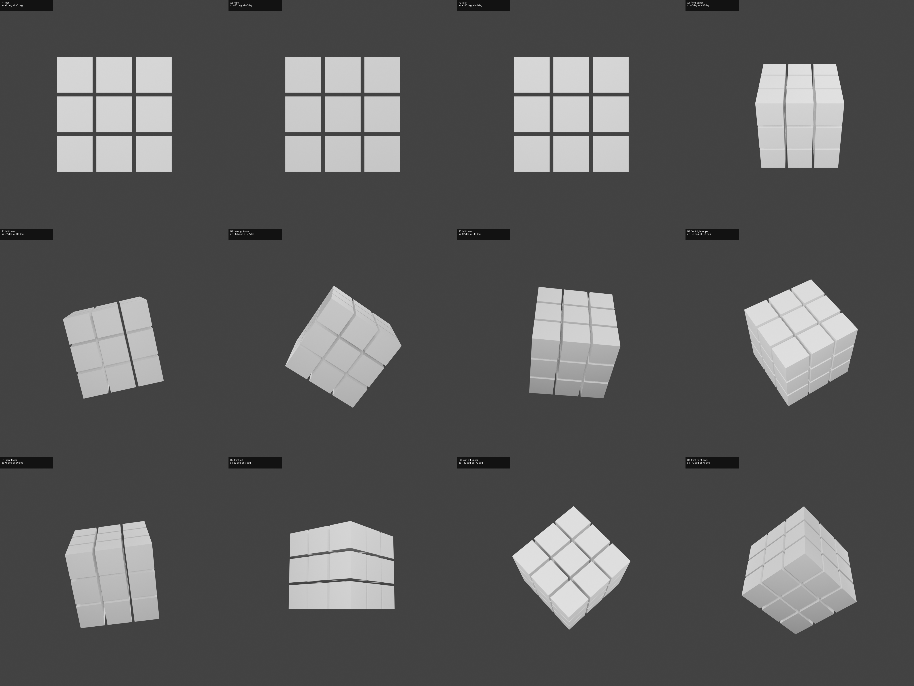
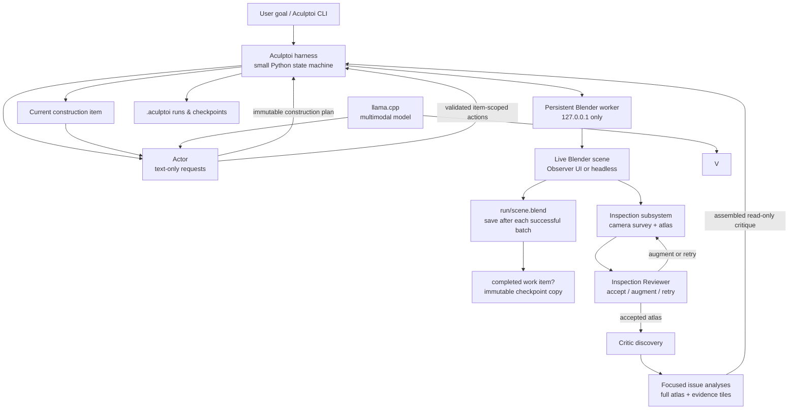

# Aculptoi

**A local-first autonomous 3D agent that plans, builds, and inspects Blender scenes.**

> Local AI that sees, builds, and refines in Blender.

Aculptoi turns a natural-language 3D goal into a bounded Blender run: it plans before
acting, validates typed scene changes, saves durable progress, and creates its own
multi-view visual evidence before a separate Critic evaluates the result. It is an
early-stage project, not a general-purpose production 3D generator.

## What Aculptoi does

Give Aculptoi a goal, then follow an explicit local feedback loop:

```text
natural-language goal
  → Actor creates an ordered construction plan
  → Actor proposes typed, item-scoped Blender actions
  → Aculptoi validates and executes them through a persistent Blender worker
  → canonical scene is saved and completed items become durable checkpoints
  → Inspection creates controlled multi-view evidence
  → Inspection Reviewer accepts, augments, or retries that survey
  → Critic Discovery finds visible issues in the accepted atlas
  → focused Critic Issue Analysis examines specific findings
  → Aculptoi refines again or completes the run
```

Aculptoi is CLI-first, Blender-native, model-agnostic, and local-first.
[llama.cpp](https://github.com/ggml-org/llama.cpp)'s OpenAI-compatible server is a
first-class setup, but cloud credentials are not required and Actor and Vision roles can
share one compatible local endpoint.

## Example: a completed autonomous run

The following tested example is from a completed Aculptoi run, not a manually created
promotional render:

> Create a simple Rubik's Cube: a clean 3×3×3 grid of evenly spaced small cubes, with visible gaps between cubies and a recognizable cube silhouette.


| Stage | Result |
| --- | --- |
| Plan | Actor decomposed the goal into four ordered construction items. |
| Build | The Blender worker completed those items and Aculptoi recorded durable checkpoints. |
| Inspect | Aculptoi rendered 12 controlled inspection views in one accepted round. |
| Review | The Inspection Reviewer accepted the visual evidence. |
| Critique | Critic Discovery found one remaining low-severity appearance issue. |
| Completion | The run completed after one construction iteration with a 0.92 score. |

Aculptoi does not judge a scene from one arbitrary screenshot. It selects multiple
controlled views, renders them with inspection lighting, and composes them into a labeled
atlas with stable tile IDs. The separate Inspection Reviewer assesses whether the survey
is technically sufficient before the Critic evaluates it.



The final Critic did not rubber-stamp the geometry: it retained one low-severity issue,
“Overall: all cubies are uniform white; no face colors to distinguish sides.” The focused analysis
records the likely missing per-face coloring and a correction criterion. This demonstrates
the closed loop: a goal is planned and built through constrained actions, visually
inspected, independently reviewed, critiqued, and preserved as inspectable run artifacts.
See [`examples/rubiks-cube`](examples/rubiks-cube/) for the tested prompt.

## Current capabilities

### Autonomous planning

- Converts a natural-language goal into an immutable, ordered construction plan.
- Works through one construction item at a time, establishing immutable completion
  criteria and allowing multiple action batches when needed.

### Safe Blender control

- Uses typed, allowlisted actions validated independently by the harness and persistent
  localhost-only Blender worker.
- Does not give model output arbitrary shell, Python, or `bpy` execution.

### Durable execution and recovery

- Saves a per-run canonical `scene.blend` after successful action batches and creates
  durable checkpoints at completed work-item boundaries.
- Resumes interrupted runs; Critic-phase recovery can reuse an accepted atlas rather than
  rebuilding visual evidence.

### Visual inspection and separate roles

- Generates deterministic camera candidates, selects multiple views, renders them with
  controlled inspection lighting, and persists the atlas and manifest.
- Separates “is the visual evidence sufficient?” (Inspection Reviewer) from “what visible
  problems exist?” (Critic Discovery) and “how should this issue be corrected?” (focused
  Critic Issue Analysis). These logical roles may share one physical multimodal model.

### Local, inspectable inference

- Uses OpenAI-compatible providers, with llama.cpp as a first-class local setup and no
  cloud provider required.
- Uses stage-specific thinking and reasoning profiles: lightweight structured stages can
  disable thinking, while Actor and focused issue analysis retain deeper reasoning.
- Preserves the original prompt, plan, item records, action results, checkpoints,
  inspection shots, atlas and manifest, reviewer verdict, Critic results, and telemetry.

The current safe action surface is deliberately small. Aculptoi does not yet provide
reliable arbitrary complex assets, production-ready topology, rich materials, automatic
UVs, rigging, animation, or broad modifier/sculpting support. See [the roadmap](#roadmap).

## Architecture



The harness is deliberately a small explicit state machine, not a heavy agent framework:

```text
inspect scene → construction plan artifact → work item → validate/execute → save canonical scene.blend
              → [continue current item or advance] → inspection survey → technical review
              → accepted atlas → issue discovery → focused issue analyses → assembled critique
```

This separation makes an eventual LangGraph integration, REST service, or MCP adapter additive rather than foundational.

## Quick start

Requirements: Python 3.12+, Blender, and (for `run`) an OpenAI-compatible local multimodal endpoint. One endpoint is the recommended simple setup; separate actor and vision endpoints remain supported. No cloud keys are required.

```bash
git clone https://github.com/ifranlaloe/Aculptoi.git
cd Aculptoi
python3 -m venv .venv
source .venv/bin/activate
python -m pip install --upgrade pip
python -m pip install -e '.[dev]'

# Checks Python, Blender, project access, worker, and configured model providers.
aculptoi doctor

# Opens the same Blender process Aculptoi will control, in Observer Mode.
aculptoi start
# Equivalent explicit form: aculptoi blender start --ui
# Use `aculptoi start --headless` for background automation.
aculptoi scene inspect --json
aculptoi object list --json
```

On macOS the default Blender path is `/Applications/Blender.app/Contents/MacOS/Blender`. On Linux and Windows-compatible shells, set `blender.executable` in `aculptoi.toml` if `blender` is not on `PATH`.

### Local llama.cpp configuration

The recommended setup is one llama.cpp server running a multimodal GGUF with its matching `mmproj` projection. Both roles use that same endpoint and model, but remain separate application roles with distinct system prompts, requests, output schemas, and permissions.

Create `aculptoi.toml` in the project root:

```toml
max_iterations = 5
max_actor_requests_per_iteration = 100
max_actions_per_iteration = 1000
iteration_timeout_seconds = 3600
score_target = 0.9

[providers.local]
base_url = "http://127.0.0.1:8080/v1"
model = "local-multimodal"
timeout_seconds = 900

[actor]
provider = "local"
# The Actor is the planning/reasoning role.
thinking = true
max_output_tokens = 16384
reasoning_effort = "medium"

[vision]
provider = "local"
# Bound the model-facing atlas while retaining the default 4096px sensor resolution.
max_image_dimension = 4096
# Discovery is bounded; only the first N summaries receive focused analysis in V1.
max_discovered_issues = 12
max_issue_analysis_requests = 12

[vision.inspection_review]
# Technical survey acceptance is a short, breadth-first decision.
thinking = false
max_output_tokens = 4096

[vision.discovery]
# Issue discovery returns a compact inventory quickly; detail comes later.
thinking = false
max_output_tokens = 4096

[vision.issue_analysis]
# Focused analysis explains one known issue while retaining the full atlas.
thinking = true
reasoning_effort = "medium"
max_output_tokens = 16384

[inspection]
# Four canonical world-space anchors are always included. Dynamic views fill gaps.
min_views = 8
max_views = 24
candidate_views = 64
coverage_target = 0.95
min_view_gain = 0.02
# More views are selected only while every atlas tile remains useful.
atlas_max_dimension = 4096
min_tile_dimension = 768
max_rounds = 3
max_total_views = 32
max_views_per_round = 24
inspection_timeout_seconds = 600
lighting_rig = "neutral-studio-v1"
sensor_version = "inspection-atlas-v1"

[blender]
host = "127.0.0.1"
port = 9876
# `ui` is the default; use `headless` for the same worker without a window.
mode = "ui"
```

`max_iterations` bounds completed visual-refinement iterations. The first Actor response
in each iteration is an immutable, descriptive construction plan with ordered items,
objectives, and dependencies. When starting each item, the work-item Actor separately
creates that item's immutable completion criteria, then Aculptoi processes the item
until it reports `complete`. This allows multiple small action batches for one item when
needed. `max_actor_requests_per_iteration`, `max_actions_per_iteration`, and
`iteration_timeout_seconds` are global runaway-safety budgets, not normal completion
conditions. Reaching one stops the iteration before further mutation and records a
`budget-exhausted.json` artifact.

The Actor defaults to `thinking = true`, `medium`, and 16,384 output tokens. Vision is
split by logical stage: the Inspection Reviewer and Critic discovery default to
`thinking = false` / 4,096, while focused issue analysis defaults to
`thinking = true` / `medium` / 16,384. Thinking determines whether a hidden reasoning
phase is requested; `reasoning_effort` determines its depth only when thinking is
enabled. These nested profiles are authoritative. Legacy top-level `[vision]`
`reasoning_effort` and `max_output_tokens` settings remain accepted when loading older
TOML files, but do not override the stage defaults; migrate them to the relevant nested
table. Image and atlas dimensions remain independently configured at 4,096px.

The default local llama.cpp context window is 65,536 tokens. The context window is the
total working window for one request; `max_output_tokens` is a completion ceiling, not a
target. Prompt tokens, image representations, optional model reasoning, and generated
tokens must all fit in the server/model context window. Aculptoi keeps role requests
compact and does not assume every compatible model supports every configured maximum.

### Prompt templates

The role prompts are human-editable, versioned Markdown files:

- [`actor_construction_plan.md`](src/aculptoi/agent/prompt_templates/actor_construction_plan.md) for the Actor's first response in an iteration;
- [`actor_work_item.md`](src/aculptoi/agent/prompt_templates/actor_work_item.md) for item-scoped action batches;
- [`inspection_reviewer.md`](src/aculptoi/agent/prompt_templates/inspection_reviewer.md) for technical atlas acceptance, augmentation, or retry;
- [`vision_issue_discovery.md`](src/aculptoi/agent/prompt_templates/vision_issue_discovery.md) for the complete-atlas, compact issue inventory; and
- [`vision_issue_analysis.md`](src/aculptoi/agent/prompt_templates/vision_issue_analysis.md) for a detailed read-only analysis of one discovered issue.

Their leading version marker is recorded in each prompt artifact. Keep their safety
boundaries intact and run the project checks after editing them.

### Critic response format

The Critic uses compact JSON **only at the model response boundary**. Discovery returns
integer percentages and tuples such as `["left_wing", "C", 97, ["A2", "B3"],
"intersects torso"]`; its five values are region, severity code, confidence percentage,
atlas tile IDs, and observation. `C/H/M/L` expand to critical/high/medium/low. Aculptoi
validates that wire format against the accepted atlas manifest, assigns deterministic IDs
in order (`issue-001`, `issue-002`, ...), converts percentages to `0.0`–`1.0`, and
derives a short human-readable discovery summary without another model call.

Focused issue analysis likewise uses short keys (`desc`, `cause`, `fix`, `criteria`,
`confidence`); Aculptoi supplies the known issue ID itself and expands the result before
it reaches the Actor. Run artifacts such as `discovery.json`, `analysis.json`, and
`critic/critique.json` always contain descriptive domain fields rather than tuples or
abbreviated keys.

### Start a local llama.cpp server

`aculptoi model serve` is an optional foreground launcher for llama.cpp. By default, it resolves the selected DavidAU Q4_K_M GGUF and `mmproj-BF16.gguf` from `HF_HOME`; it does not download missing artifacts. Thinking and reasoning effort are selected per logical model stage, rather than by a server-wide fixed reasoning-token budget. It requires `HF_HOME` to be set explicitly; if it is absent, the command explains how to set it and exits before inspecting model paths.

```bash
export HF_HOME=/absolute/path/to/huggingface

# Start the default DavidAU multimodal pair cached under HF_HOME.
aculptoi model serve

# Override both artifacts for another compatible multimodal model.
aculptoi model serve \
  -m "$HF_HOME/hub/models--your-org--your-model/snapshots/<revision>/model-Q4_K_M.gguf" \
  --mmproj "$HF_HOME/hub/models--your-org--your-model/snapshots/<revision>/mmproj-F16.gguf"
```

It starts the following local-only process with the supplied artifact paths:

```bash
llama serve \
  -m /path/to/model-Q4_K_M.gguf \
  --mmproj /path/to/mmproj-F16.gguf \
  -c 65536 \
  -np 1 \
  -fa on \
  -ctk q8_0 \
  -ctv q8_0 \
  -a aculptoi \
  --host 127.0.0.1 \
  --port 8080
```

Use `--dry-run --json` to inspect the exact argument vector without launching a process.

To use separate models or servers, define two providers and select one per role:

```toml
[providers.actor]
base_url = "http://127.0.0.1:8080/v1"
model = "local-actor"

[providers.vision]
base_url = "http://127.0.0.1:8081/v1"
model = "local-vision"

[actor]
provider = "actor"

[vision]
provider = "vision"
```

Models and endpoint URLs are examples only—the core Actor/Critic provider architecture does not hard-code Qwen, llama.cpp, or any cloud provider. The optional `model serve` convenience command has a user-selected DavidAU default and accepts explicit overrides. The Actor is the planning/reasoning role: its semantic `reasoning_effort` reaches the provider without a numeric translation, while only its final JSON action plan reaches the action validator. The Critic remains read-only, even if the shared model reasons while examining images. The actor remains text-only by default. The Inspection Reviewer first accepts a single standardized atlas; the critic then scans that complete atlas through an OpenAI-compatible `image_url` data URL and preserves the same full atlas for each focused issue analysis. Tile IDs direct attention without removing cross-view context. Original run artifacts are never modified. `max_discovered_issues` and `max_issue_analysis_requests` bound the resulting request fan-out. This assumes an endpoint that accepts OpenAI chat-completions multimodal content, as current vision-capable llama.cpp server builds do.

For llama.cpp's Jinja/chat-template route, the provider sends semantic settings through
`chat_template_kwargs`: non-thinking stages send `enable_thinking = false` without a
reasoning-effort value, while thinking stages send `enable_thinking = true` and their
configured `reasoning_effort`. `thinking_transport` may explicitly select
`chat_template_kwargs`, `top_level`, or `omit`; when unset, it follows
`reasoning_effort_transport` for backwards compatibility. A provider configured with
both transports set to `"omit"` receives neither setting. Aculptoi never treats low
reasoning effort as an alias for disabled thinking and never converts an effort level
into a token budget.

[DavidAU's Qwen3.8-27B-TURBO-Fable-Cold-Fusion GGUF](https://huggingface.co/DavidAU/Qwen3.8-27B-TURBO-Fable-Cold-Fusion-735-882-Heretic-Uncensored-NEO-CODER-MAX-MTP-GGUF) is the current `aculptoi model serve` default when its selected Q4_K_M GGUF and `mmproj-BF16.gguf` are present in `HF_HOME`. It is not bundled, and explicit artifact overrides remain supported.

## CLI

All commands that return operational data accept `--json`.

```bash
aculptoi doctor
aculptoi config show --json

aculptoi model serve -m "$HF_HOME/.../model.gguf" --mmproj "$HF_HOME/.../mmproj.gguf"

aculptoi start
aculptoi blender status --json
aculptoi blender stop

aculptoi scene inspect --json
aculptoi object list --json
aculptoi object inspect Cube --json

aculptoi render views Dragon --views front,right,top,perspective --json

aculptoi checkpoint list --run 1 --json
aculptoi checkpoint restore --run 1

aculptoi run "create a simple creature" --json
# `create` is a convenience alias for `run`.
aculptoi create "a western dragon"
# Restore the latest durable item checkpoint and restart an incomplete item.
aculptoi refine
```

`run` requires the Blender worker and the configured local provider or providers to be running. It limits the number of iterations via `max_iterations`, uses deterministic (`temperature: 0`) model requests where supported, and creates artifacts under:

```text
.aculptoi/
└── runs/
    └── 000001/
        ├── scene.blend                 # mutable canonical working scene
        ├── initial-scene.blend         # recovery base before any item completes
        ├── run-state.json               # typed durable/recovery state (authoritative)
        ├── run-events.jsonl             # append-only observational timing/usage events
        ├── checkpoints/                 # immutable completed-item boundaries
        │   ├── item-001-001-base-layer.blend
        │   └── item-001-002-upper-layer.blend
        ├── recovery/                    # optional abandoned partial scenes
        ├── user-prompt.txt
        └── iteration-001/
            ├── actor/
            │   ├── construction-plan-prompt.json
            │   ├── construction-plan.json
            │   └── items/
            │       ├── 001-base-layer/
            │       │   ├── item.json
            │       │   ├── actor-prompt-001.json
            │       │   ├── actor-response-001.json
            │       │   ├── action-result-001.json
            │       │   ├── checkpoint.json
            │       │   └── summary.json
            │       └── 002-upper-layer/
            │           └── ...
            ├── inspection/
            │   ├── round-001/
            │   │   ├── request.json
            │   │   ├── camera-plan.json
            │   │   ├── shots/A1.png
            │   │   ├── atlas.png
            │   │   ├── atlas-manifest.json
            │   │   ├── review-prompt.json
            │   │   └── review.json
            │   └── summary.json
            ├── critic/
            │   ├── discovery-prompt.json
            │   ├── discovery.json
            │   └── issues/
            │       ├── issue-001/
            │       │   ├── summary.json
            │       │   ├── analysis-prompt.json
            │       │   └── analysis.json
            │       └── issue-002/
            │           └── analysis-error.json
            │   └── critique.json
            ├── iteration-summary.json
            └── checkpoint.json          # references the latest durable item checkpoint
```

`user-prompt.txt` contains the exact human request for the run. Each iteration starts
with a planning-only Actor request and an immutable, descriptive
`construction-plan.json`. The first Actor response for every item separately constructs
and persists immutable `completion-criteria.json`; later item responses use but cannot
replace it. Every ordered item retains its definition, stateless Actor prompts, validated
action batches, worker results, checkpoint metadata, and `.blend` snapshots. All item
artifacts carry the construction-plan ID, work-item ID, and action-batch number. The
iteration retains the Inspection subsystem's selected shots, atlas, manifest, and
technical review, plus the Critic discovery inventory, focused per-issue analysis
artifacts (without duplicating image data URLs), assembled critique, and summary.
`scene.blend` at the run root is the worker's active, mutable
canonical scene and is saved after every successful action batch. A completed work item
causes that already-saved file to be copied atomically into `checkpoints/`; only then is
the item marked durable in `run-state.json`.
The model-facing compact response is validated and expanded before persistence, so these
artifacts remain readable even though critic inference uses fewer response tokens.
Each work-item request receives a fresh scene inspection for current object names and
transforms, plus compact semantic lineage for completed items, including their
object-name traces. There is no global checkpoint directory: each run contains the only
checkpoints that can recover it.

When a model returns malformed JSON or data that fails an output schema, Aculptoi also
retains an error record and raw response beside the failed construction-plan, work-item,
discovery, or focused issue-analysis request. A malformed focused issue response leaves
that issue summary intact while other issue analyses can still complete. This makes local
debugging possible without weakening validation.
Raw responses can contain model reasoning or user-derived context, so treat
`.aculptoi/` as local diagnostic data. All run artifacts are intentionally ignored by
Git.

### Durable runs, recovery, and live observation

Each run owns exactly one canonical working file: `.aculptoi/runs/<run-id>/scene.blend`.
The active worker keeps that file loaded and saves it after every successful typed action
batch. That means the canonical file can contain partial work on the active construction
item. It is deliberately *not* a checkpoint. A run-local worker lock prevents a second
Aculptoi worker from claiming the same active canonical scene; stale locks are recoverable
after a worker crash.

When an Actor marks a work item `complete`, Aculptoi saves the canonical scene, copies it
to the run-local `checkpoints/` directory, records that copy in `run-state.json`, and only
then considers the item durable. A failed save or failed checkpoint copy stops the run; it
never falsely reports the item as durable.

On `aculptoi refine`, an interrupted run first preserves a diagnostic copy of its partial
canonical scene when possible, restores the latest durable checkpoint (or the immutable
initial scene if none has completed), reloads the canonical scene into the worker, and
restarts the active work item from its first action batch. It never tries to guess which
partial actions are safe to keep. A missing checkpoint named by `run-state.json` is a safe,
actionable failure rather than a guessed recovery.

After construction is durable, `run-state.json` instead records the active `inspection`
or `critic` phase. Recovery remains in that same iteration: an interrupted inspection
writes a separately namespaced recovery attempt, while an interrupted Critic phase
reuses its persisted accepted atlas and manifest rather than creating new visual evidence.

`run-events.jsonl` records lifecycle and expensive-stage timing, effective provider
profiles, contextual identifiers, errors, and provider-reported token usage when
available. It is append-only and observational: `run-state.json`, canonical scenes,
checkpoints, and accepted inspection artifacts remain the recovery authority. Runs
created before telemetry or before stage profiles remain resumable; resume creates
telemetry lazily and never fabricates historical events.

`aculptoi start` and `aculptoi start --ui` open the actual worker-controlled Blender
process in **Observer Mode**. It is the same live in-memory scene the Actor mutates, not a
second viewer. The observer workspace is labelled **Aculptoi Observer** and prevents normal
object selection to reduce accidental transforms, deletion, edit-mode changes, and undo/redo
interference; users can orbit, pan, zoom, and change ordinary viewport display settings.
Inspection source renders always use Aculptoi-controlled deterministic cameras and
lighting, never the observer's viewport or artistic lighting.

Observer Mode is accidental-interference protection, not a security boundary. A determined
user can still alter Blender internals or bypass UI restrictions. Do not open or save an
active run's `scene.blend` in another Blender process: separate processes do not live-sync,
and concurrent saves can corrupt the operator's view of the run. Use `aculptoi start` to
observe an active run; open a completed run separately only after its worker is inactive.

Set `[blender] mode = "headless"` in `aculptoi.toml`, or pass `--headless`, to run exactly
the same worker, persistence, checkpoint, and recovery path without a visible window.

## V1 action boundary

The actor never receives shell access. Its responses must match Pydantic schemas, and the Blender worker repeats its own validation before it changes the scene. V1 accepts only:

| Family | Commands |
| --- | --- |
| Objects | `object.create`, `object.delete`, `object.translate`, `object.rotate`, `object.scale` |
| Sculpt | `sculpt.voxel_remesh` |

Scene inspection, object inspection, multi-view rendering, and checkpoint operations use dedicated worker routes—not arbitrary `bpy` strings. Unsupported commands, arbitrary file paths, shell commands, and Python/`bpy` snippets are rejected. `execute_bpy` is intentionally absent.

## Safety

Blender automation is code execution adjacent and should be treated carefully. The worker listens only on localhost by default, validates every request, constrains artifact paths to the current project's `.aculptoi/` directory, bounds request size, and uses checkpoint recovery. Keep the worker on a trusted machine and do not expose its port with a tunnel or port-forwarding rule.

Read the full [threat model](SECURITY.md) before connecting an untrusted model or project.

## Development

```bash
python -m pip install -e '.[dev]'
ruff check .
ruff format --check .
pytest
mypy src
```

See [CONTRIBUTING.md](CONTRIBUTING.md) for contribution guidance and [docs/architecture.md](docs/architecture.md) for component boundaries.

For the project’s shared terminology—including the distinction between model-provider code and local model weights—see [docs/ubiquitous-language.md](docs/ubiquitous-language.md).

## Roadmap

- [ ] Additional safe sculpt operations (smooth, inflate, grab) and modifiers
- [ ] Automatic creature construction and semantic scene planning
- [ ] Topology analysis, UV/material generation, rigging, and animation
- [ ] Visual progress scoring and adaptive camera selection
- [ ] Multiple actor models and model-routing policies
- [ ] Blender add-on UI
- [ ] Optional MCP adapter (not a core dependency)
- [ ] REST API
- [ ] Benchmark and evaluation suite
- [ ] Optional headless `--no-daemon` batch mode

## Contributing

Contributions are welcome, especially small improvements to safety, reproducibility, Blender testing, and documentation. Please open an issue before a large architectural change and keep the action boundary explicit. See [CONTRIBUTING.md](CONTRIBUTING.md).

## License

Licensed under the [Apache License 2.0](LICENSE).
