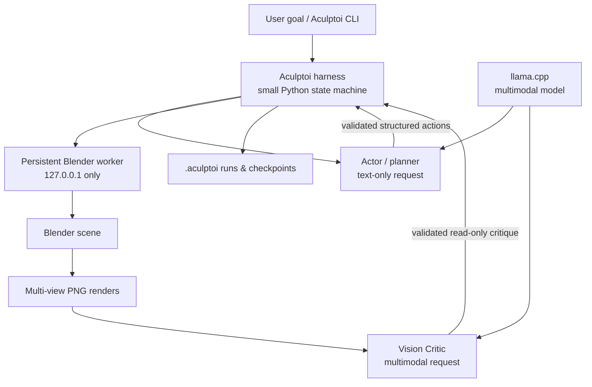

# Aculptoi

**A local-first autonomous 3D agent for Blender.**

> Local AI that sees, builds, and refines in Blender.

Aculptoi can build 3D objects, look at its own work from multiple viewpoints, critique the result using a local multimodal model, and iteratively refine the Blender scene. It is an early-stage, experimental project: V1 establishes the safe, inspectable architecture rather than attempting fully autonomous sculpting.

## Why Aculptoi?

Most 3D agents stop at generating code or issue opaque operations. Aculptoi is designed to close a local feedback loop: an Actor proposes constrained scene changes, a persistent Blender worker performs them, renders provide evidence, and a Vision Critic evaluates the result. Every iteration produces files that a person can inspect.

It is CLI-first, Blender-native, model-agnostic, and local-first. [llama.cpp](https://github.com/ggml-org/llama.cpp)'s OpenAI-compatible server is a first-class target, but any compatible local endpoint can be configured. MCP is not required and is deliberately not in the core architecture.

## Status

V1 is a usable foundation. It includes:

- a typed, allowlisted action language and independent validation at the harness and worker boundaries;
- a persistent localhost-only Blender HTTP worker;
- scene/object inspection, four inspection renders, `.blend` checkpoints, and a bounded actor → Blender → vision loop;
- named OpenAI-compatible providers that can be shared by the separate Actor and Vision Critic roles; and
- structured JSON output for operational commands.

It does **not** yet autonomously make sophisticated creatures, offer broad sculpt tooling, or provide an add-on UI. See [the roadmap](#roadmap).

## Architecture



The harness is deliberately a small explicit state machine, not a heavy agent framework:

```text
inspect scene → actor plan → validate → execute → render views → vision critique → checkpoint
```

This separation makes an eventual LangGraph integration, REST service, or MCP adapter additive rather than foundational.

## Quick start

Requirements: Python 3.12+, Blender, and (for `run`) an OpenAI-compatible local multimodal endpoint. One endpoint is the recommended simple setup; separate actor and vision endpoints remain supported. No cloud keys are required.

```bash
git clone https://github.com/ifranlaloe/Aculptoi.git
cd Aculptoi
python3 -m venv .venv
source .venv/bin/activate
python -m pip install --upgrade pip
python -m pip install -e '.[dev]'

# Checks Python, Blender, project access, worker, and configured model providers.
aculptoi doctor

# Starts one background Blender process; it stays up between commands.
aculptoi blender start
aculptoi scene inspect --json
aculptoi object list --json
```

On macOS the default Blender path is `/Applications/Blender.app/Contents/MacOS/Blender`. On Linux and Windows-compatible shells, set `blender.executable` in `aculptoi.toml` if `blender` is not on `PATH`.

### Local llama.cpp configuration

The recommended setup is one llama.cpp server running a multimodal GGUF with its matching `mmproj` projection. Both roles use that same endpoint and model, but remain separate application roles with distinct system prompts, requests, output schemas, and permissions.

Create `aculptoi.toml` in the project root:

```toml
[providers.local]
base_url = "http://127.0.0.1:8080/v1"
model = "local-multimodal"

[actor]
provider = "local"

[vision]
provider = "local"
# Renders are resized in memory for inference; source PNG artifacts remain unchanged.
max_image_dimension = 1280

[blender]
host = "127.0.0.1"
port = 9876

max_iterations = 5
score_target = 0.9
```

### Start a local llama.cpp server

`aculptoi model serve` is an optional foreground launcher for llama.cpp. By default, it resolves the selected DavidAU Q4_K_M GGUF and `mmproj-BF16.gguf` from `HF_HOME`; it does not download missing artifacts. It requires `HF_HOME` to be set explicitly; if it is absent, the command explains how to set it and exits before inspecting model paths.

```bash
export HF_HOME=/absolute/path/to/huggingface

# Start the default DavidAU multimodal pair cached under HF_HOME.
aculptoi model serve

# Override both artifacts for another compatible multimodal model.
aculptoi model serve \
  -m "$HF_HOME/hub/models--your-org--your-model/snapshots/<revision>/model-Q4_K_M.gguf" \
  --mmproj "$HF_HOME/hub/models--your-org--your-model/snapshots/<revision>/mmproj-F16.gguf"
```

It starts the following local-only process with the supplied artifact paths:

```bash
llama serve \
  -m /path/to/model-Q4_K_M.gguf \
  --mmproj /path/to/mmproj-F16.gguf \
  -c 32768 \
  -np 1 \
  -fa on \
  -ctk q8_0 \
  -ctv q8_0 \
  -a aculptoi \
  --host 127.0.0.1 \
  --port 8080
```

Use `--dry-run --json` to inspect the exact argument vector without launching a process.

To use separate models or servers, define two providers and select one per role:

```toml
[providers.actor]
base_url = "http://127.0.0.1:8080/v1"
model = "local-actor"

[providers.vision]
base_url = "http://127.0.0.1:8081/v1"
model = "local-vision"

[actor]
provider = "actor"

[vision]
provider = "vision"
```

Models and endpoint URLs are examples only—the core Actor/Critic provider architecture does not hard-code Qwen, llama.cpp, or any cloud provider. The optional `model serve` convenience command has a user-selected DavidAU default and accepts explicit overrides. The actor remains text-only by default. The critic sends resized in-memory PNG copies through OpenAI-compatible `image_url` data URLs; the original run artifacts are never modified. This assumes an endpoint that accepts OpenAI chat-completions multimodal content, as current vision-capable llama.cpp server builds do.

[DavidAU's Qwen3.8-27B-TURBO-Fable-Cold-Fusion GGUF](https://huggingface.co/DavidAU/Qwen3.8-27B-TURBO-Fable-Cold-Fusion-735-882-Heretic-Uncensored-NEO-CODER-MAX-MTP-GGUF) is the current `aculptoi model serve` default when its selected Q4_K_M GGUF and `mmproj-BF16.gguf` are present in `HF_HOME`. It is not bundled, and explicit artifact overrides remain supported.

## CLI

All commands that return operational data accept `--json`.

```bash
aculptoi doctor
aculptoi config show --json

aculptoi model serve -m "$HF_HOME/.../model.gguf" --mmproj "$HF_HOME/.../mmproj.gguf"

aculptoi blender start
aculptoi blender status --json
aculptoi blender stop

aculptoi scene inspect --json
aculptoi object list --json
aculptoi object inspect Cube --json

aculptoi render views Dragon --views front,right,top,perspective --json

aculptoi checkpoint save iteration-12
aculptoi checkpoint list --json
aculptoi checkpoint restore iteration-11

aculptoi run "create a simple creature" --json
# `create` is a convenience alias for `run`.
aculptoi create "a western dragon"
# Restore the latest recorded checkpoint and continue its goal.
aculptoi refine
```

`run` requires the Blender worker and the configured local provider or providers to be running. It limits the number of iterations via `max_iterations`, uses deterministic (`temperature: 0`) model requests where supported, and creates artifacts under:

```text
.aculptoi/
├── checkpoints/
│   └── run-000001-iteration-001.blend
└── runs/
    └── 000001/
        ├── actor-plan-001.json
        ├── actions-001.json
        ├── critique-001.json
        ├── checkpoint-001.json
        └── iteration-001/
            ├── front.png
            ├── right.png
            ├── top.png
            └── perspective.png
```

The checkpoint metadata records iteration, timestamp, goal, plan, executed actions, scene snapshot reference, render paths, critique, and score across its associated JSON artifacts. These files are intentionally ignored by Git.

## V1 action boundary

The actor never receives shell access. Its responses must match Pydantic schemas, and the Blender worker repeats its own validation before it changes the scene. V1 accepts only:

| Family | Commands |
| --- | --- |
| Objects | `object.create`, `object.delete`, `object.translate`, `object.rotate`, `object.scale` |
| Sculpt | `sculpt.voxel_remesh` |

Scene inspection, object inspection, multi-view rendering, and checkpoint operations use dedicated worker routes—not arbitrary `bpy` strings. Unsupported commands, arbitrary file paths, shell commands, and Python/`bpy` snippets are rejected. `execute_bpy` is intentionally absent.

## Safety

Blender automation is code execution adjacent and should be treated carefully. The worker listens only on localhost by default, validates every request, constrains artifact paths to the current project's `.aculptoi/` directory, bounds request size, and uses checkpoint recovery. Keep the worker on a trusted machine and do not expose its port with a tunnel or port-forwarding rule.

Read the full [threat model](SECURITY.md) before connecting an untrusted model or project.

## Development

```bash
python -m pip install -e '.[dev]'
ruff check .
ruff format --check .
pytest
mypy src
```

See [CONTRIBUTING.md](CONTRIBUTING.md) for contribution guidance and [docs/architecture.md](docs/architecture.md) for component boundaries.

For the project’s shared terminology—including the distinction between model-provider code and local model weights—see [docs/ubiquitous-language.md](docs/ubiquitous-language.md).

## Roadmap

- [ ] Additional safe sculpt operations (smooth, inflate, grab) and modifiers
- [ ] Automatic creature construction and semantic scene planning
- [ ] Topology analysis, UV/material generation, rigging, and animation
- [ ] Visual progress scoring and adaptive camera selection
- [ ] Multiple actor models and model-routing policies
- [ ] Blender add-on UI
- [ ] Optional MCP adapter (not a core dependency)
- [ ] REST API
- [ ] Benchmark and evaluation suite
- [ ] Optional headless `--no-daemon` batch mode

## Contributing

Contributions are welcome, especially small improvements to safety, reproducibility, Blender testing, and documentation. Please open an issue before a large architectural change and keep the action boundary explicit. See [CONTRIBUTING.md](CONTRIBUTING.md).

## License

Licensed under the [Apache License 2.0](LICENSE).
