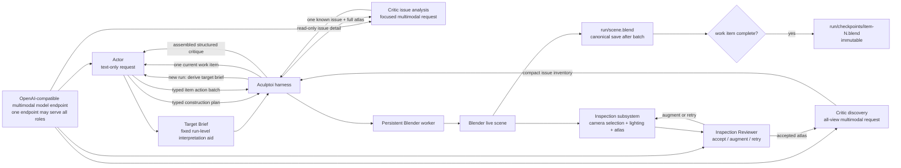
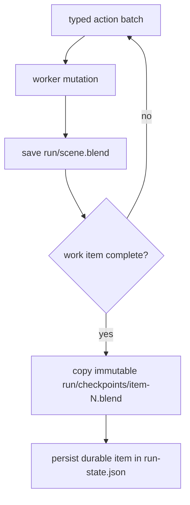

# Architecture

Aculptoi keeps orchestration separate from scene execution. The Actor, Inspection Reviewer,
Critic Discovery, and focused Critic Issue Analysis are separate logical roles even when
they share one multimodal provider, model endpoint, and set of weights.



| Component | Responsibility | May mutate Blender? |
| --- | --- | --- |
| CLI | User intent, configuration, stable JSON output | No |
| Harness | Plan-first visual-refinement state machine, work-item scheduling, safety-budget enforcement, and artifact recording | Via worker only |
| Actor | On a new run, first derives one bounded Target Brief; then creates an ordered construction plan and proposes typed actions for one active item at a time; requests are text-only by default | No |
| Blender client | Versioned local transport abstraction | Sends validated actions |
| Blender worker | Independently validates and performs allowlisted operations | Yes |
| Inspection subsystem | Selects deterministic camera evidence, renders it with isolated lighting, composes an atlas, and obtains technical acceptance | No |
| Inspection Reviewer | Assesses observation quality only and returns `accept`, `augment`, or `retry` | No |
| Vision critic | Discovers compact issues from an accepted atlas, then analyzes selected known issues with that full atlas retained | No |
| Model provider | Reusable OpenAI-compatible endpoint client; may serve all logical roles while their prompts, schemas, profiles, and permissions remain separate | No |
| Checkpoint store | Writes inspectable state/artifacts and atomically copies a saved canonical scene into run-local immutable checkpoints | No scene mutation |

The HTTP transport is purposefully small and local-only. A Unix socket or a headless batch
transport can replace the client implementation without changing actor, critic, schemas,
or loop semantics.

`[providers.<name>]` defines an endpoint once. `[actor]` and `[vision]` each select it by name. The default `local` provider is selected by both roles, so one llama.cpp multimodal server is enough. Selecting different provider names preserves the two-endpoint topology. Sharing a provider only shares its reusable HTTP client; it does not create shared conversation history, grant the critic mutation authority, or merge the role prompts or schemas.

## Local inference token budgets

The default local topology uses a **65,536-token llama.cpp context window**. Output
budgets are completion ceilings passed through the shared OpenAI-compatible request
builder as `max_tokens`; they do not reserve or force that many generated tokens.
Reasoning effort is a separate semantic role setting. The default profiles are:

| Logical stage | Thinking | Reasoning effort | Maximum output tokens |
| --- | --- | --- | --- |
| Actor construction plan and work item | enabled | `medium` | 16,384 |
| Inspection Reviewer | disabled | — | 4,096 |
| Critic discovery | disabled | — | 4,096 |
| Critic focused issue analysis | enabled | `medium` | 16,384 |

The Reviewer and discovery stages make bounded, breadth-first decisions; focused
analysis is deliberately allocated the deeper profile. `[vision.inspection_review]`,
`[vision.discovery]`, and `[vision.issue_analysis]` are independently configurable.
`thinking` requests whether a hidden reasoning phase exists, whereas `reasoning_effort`
requests its depth only when thinking is enabled. Older top-level Vision generation
settings still parse for compatibility but do not override these stage profiles. For
llama.cpp Jinja templates, the default provider adapter uses
`chat_template_kwargs.enable_thinking`; it adds `reasoning_effort` only when thinking is
enabled. `thinking_transport` can independently use the same chat-template route, a
top-level field, or omission; by default it follows the existing reasoning-effort
transport. Configure both transports as `omit` to send neither setting.
Prompt text, image-token representations, model reasoning, and generated output must fit
together within the server's total context window.

The inspection atlas preserves the configured tile detail when it is placed in an
OpenAI-compatible image data URL. Other PNG inputs retain the existing in-memory dimension
bound. Stored inspection renders and their atlas remain durable source artifacts.

## Critic wire format and domain model

The Critic response boundary is deliberately compact, while the harness, Actor, and run
artifacts use rich descriptive models. `VisualIssueDiscoveryWire` accepts only
`{"score": 58, "issues": [["left_wing", "C", 97, ["A2", "B3"], "intersects torso"]]}`.
The five tuple values are region, severity code, integer confidence percentage,
atlas tile IDs, and observation. The converter validates tile IDs against the accepted
atlas manifest, assigns ordered deterministic IDs, expands percentages to `0.0`–`1.0`,
and derives the persisted discovery summary without another model request.

`VisualIssueDetailWire` accepts focused details with short keys: `desc`, `evidence`,
`cause`, `fix`, `criteria`, `confidence`, and optional `conflict`. It deliberately has
no issue ID; the harness supplies the existing discovery ID when converting to
`VisualIssueDetail`. Raw tuples and abbreviated keys never cross into the Actor,
checkpoint records, or final `VisualCritique`. Discovery and per-issue JSON artifacts
are expanded domain JSON for normal human inspection.

Each new run begins with `user-prompt.txt`, containing the exact human goal, then the Actor
derives one bounded `target-brief.json`. The goal remains authoritative; the brief is a
durable interpretation aid for later role-specific modeling context. Historic runs without
one receive a deterministic fallback, while a pending new brief without its artifact is a
safe resume failure. Each visual-refinement iteration has its own `iteration-XXX/`
directory. Its first planning response is a typed construction plan, persisted immutably as
`construction-plan.json`. It is descriptive: it names ordered items, objectives, and
dependencies but does not define actions or completion criteria. The harness processes that
plan in order. Each construction item has an `actor/items/NNN-id/` directory containing
its immutable definition, the work-item Actor's immutable `completion-criteria.json`,
every stateless Actor prompt, validated action batch, worker result, checkpoint
metadata, and checkpoint reference. The Actor creates the completion criteria in its first
response for the item, then explicitly returns `continue` or `complete` against those
criteria. Every item request also includes a fresh full scene inspection, the immutable
construction plan, and compact summaries of completed items. The scene is the source of
truth for current object state; summaries preserve semantic lineage and trace the object
names created or affected by earlier items. Only after every item is complete does the harness invoke the **Inspection subsystem**.
It samples 64 deterministic object-centered candidate viewpoints, retains four canonical
world-space anchors (`front`, `right`, `rear`, and `front-upper`), greedily adds views
using approximate mesh-surface coverage, low-resolution silhouette novelty, and screen
occupancy, and stops before atlas tiles fall below the configured resolution. The Blender
worker obtains candidate diagnostics from evaluated world-space geometry and 128px alpha
silhouettes, then renders only selected final cameras in an isolated neutral-studio
environment. It derives framing from current bounds, links source objects without changing
them, and removes its temporary scene, camera, world, lights, and collections afterward.
The harness labels and composes the source shots into an atlas and persists an atlas manifest.
The read-only Inspection Reviewer may accept, augment, or retry this bounded survey.
Only an accepted atlas reaches the Vision Critic. The critic first performs a complete-atlas
**issue discovery** pass, then the harness applies its explicit bounded selection policy:
V1 analyzes the first `max_issue_analysis_requests` discovery entries. Each focused
analysis receives the same full atlas while tile IDs direct attention. The harness
assembles summaries, details, and any per-issue analysis-failure markers into the final
critique consumed by the next Actor planning request. Discovery identity fields are never
rewritten by focused analysis.

Normal progress has no fixed per-item or per-iteration action-batch count. Operator
configured Actor-request, action-count, and wall-clock budgets remain global safety
backstops. If one is exhausted, the harness records `budget-exhausted.json` and stops
before another scene mutation. On model-response parsing or schema
failure, the corresponding plan, item, discovery, or issue analysis retains an error JSON
artifact and raw response text for local debugging; that diagnostic data never gains
execution authority. A focused issue failure is isolated: it leaves the immutable
discovery summary available to the Actor and does not discard successful issue details.

## Canonical scene, durability, and recovery

Every run owns exactly one mutable canonical file:

```text
.aculptoi/runs/<run-id>/scene.blend
```

The attached worker is its sole active owner. The harness saves it after every successful
typed action batch. That file may therefore contain partial work for the active item. A
checkpoint is different: only after an Actor reports `complete` does the harness copy the
already-saved canonical file atomically to
`checkpoints/item-<iteration>-<ordinal>-<work-item>.blend`, record it in typed
`run-state.json`, and clear the active item. A copy failure leaves the canonical scene
intact but the item non-durable.



The run root also has an append-only `run-events.jsonl` stream. It records lifecycle
transitions and the duration, effective inference profile, contextual identifiers,
outcome, error metadata, and provider-reported usage for costly stages. It is strictly
observational: recovery reads typed `run-state.json`, canonical scenes, checkpoints, and
accepted inspection artifacts, never telemetry. A resumed older run may create the file
for new events but does not synthesize events from its history.

On an interrupted run, `run-state.json` names the latest durable checkpoint and active
item. Resume preserves the partial canonical scene under `recovery/` when possible,
restores that checkpoint over `scene.blend`, reloads it into the worker, and starts the
incomplete item from its first batch. If no item completed, it restores the immutable
`initial-scene.blend`. Inconsistent state or a missing checkpoint is a safe failure, not a
reason to guess at partial action replay.

Within one active work item, a structured recoverable worker failure follows a smaller version
of this recovery path: the worker and harness reload the last saved canonical scene, the harness
obtains a fresh scene inspection, then compiles a new Actor request for the same item with the
immediate failed execution outcome. This is execution feedback, not persistent model chat
memory. The immutable plan and completion criteria remain unchanged, attempted actions still
consume safety budget, and no mutation from the failed batch is considered durable. A
non-recoverable `worker_error` stops the run instead of asking the Actor to adapt around an
internal implementation fault.

Once all items are durable, run state records an active `inspection` or `critic` phase
instead. Resume stays in the same iteration: an interrupted inspection receives a
fresh recovery-attempt artifact namespace, while an interrupted Critic phase reloads
the persisted accepted atlas and manifest and writes only new Critic artifacts. Neither
path replays Actor work or skips visual evaluation.

## Worker modes and observer UI

The worker runs in one of two modes with the same transport, action schemas, persistence,
and recovery logic:

- **UI / Observer Mode** (default; `aculptoi start` or `aculptoi start --ui`) runs the
  worker inside the visible Blender process. HTTP handler threads enqueue all `bpy` work
  onto Blender's main-thread timer queue, returning control to the UI between batches.
  The workspace is labelled **Aculptoi Observer** and marks scene objects unselectable to
  reduce accidental edits while leaving viewport navigation available.
- **Headless Mode** (`aculptoi start --headless` or `[blender] mode = "headless"`) uses
  Blender background mode with the same run ownership and save/checkpoint semantics.

Observer navigation never supplies Critic imagery. `render_views` constructs and removes
its own deterministic inspection camera, restoring the scene camera afterwards. Observer
restrictions protect against accidents only; they are not a security boundary against a
user deliberately changing Blender internals.

Role instructions are versioned Markdown templates under
`src/aculptoi/agent/prompt_templates/`. Target-brief derivation, construction planning,
and work-item execution have separate Actor templates and schemas, while issue discovery
and focused issue analysis have separate Critic templates and schemas. All remain
role-specific with no direct mutation authority. The small Python loader validates template
version markers and supplies the content to requests; it does not contain role-instruction
prose. See [modeling details](modeling.md) for the bounded semantic mesh surface and
role-specific knowledge context.

`blender/aculptoi_worker.py` is standalone so it can execute inside Blender's Python environment without requiring the project's normal Python dependencies. It must remain an explicit-route, allowlisted server.
