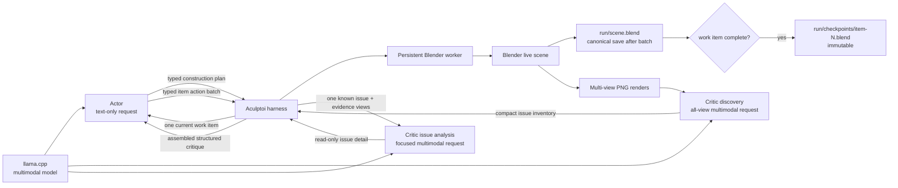
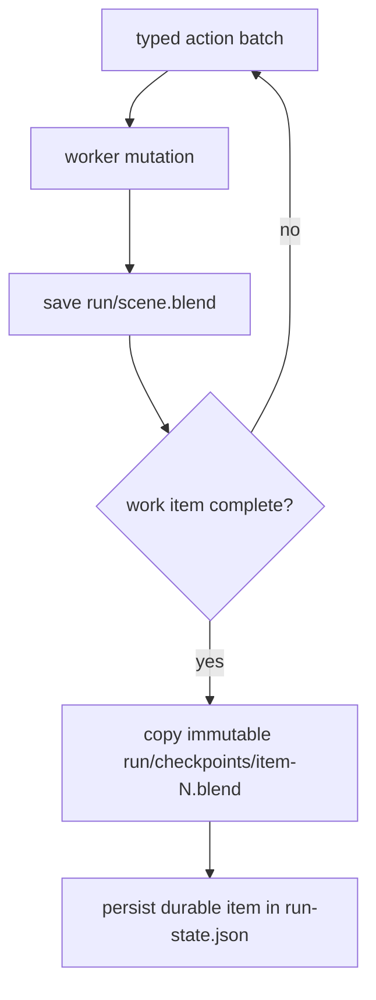

# Architecture

Aculptoi keeps orchestration separate from scene execution. The Actor and Vision Critic are separate roles even when they share a single multimodal provider, model endpoint, and set of weights.



| Component | Responsibility | May mutate Blender? |
| --- | --- | --- |
| CLI | User intent, configuration, stable JSON output | No |
| Harness | Plan-first visual-refinement state machine, work-item scheduling, safety-budget enforcement, and artifact recording | Via worker only |
| Actor | First creates an ordered construction plan, then proposes typed actions for one active item at a time; requests are text-only by default | No |
| Blender client | Versioned local transport abstraction | Sends validated actions |
| Blender worker | Independently validates and performs V1 operations | Yes |
| Vision critic | Discovers compact issues across prepared PNG renders, then analyzes selected known issues into structured, read-only feedback | No |
| Model provider | Reusable OpenAI-compatible endpoint client; may be selected by one or both roles | No |
| Checkpoint store | Writes inspectable state/artifacts and atomically copies a saved canonical scene into run-local immutable checkpoints | No scene mutation |

The HTTP transport is purposefully small and local-only in V1. A Unix socket or a headless batch transport can replace the client implementation without changing actor, critic, schemas, or loop semantics.

`[providers.<name>]` defines an endpoint once. `[actor]` and `[vision]` each select it by name. The default `local` provider is selected by both roles, so one llama.cpp multimodal server is enough. Selecting different provider names preserves the two-endpoint topology. Sharing a provider only shares its reusable HTTP client; it does not create shared conversation history, grant the critic mutation authority, or merge the role prompts or schemas.

## Local inference token budgets

The default local topology uses a **65,536-token llama.cpp context window**. Both the
Actor and Vision Critic have independently configurable **16,384-token maximum output**
budgets and default to **`reasoning_effort = "medium"`**. Output budgets are completion
ceilings passed through the shared OpenAI-compatible request builder as `max_tokens`; they
do not reserve or force that many generated tokens. Reasoning effort is a separate semantic
role setting. For llama.cpp Jinja templates, the default provider adapter forwards it as
one `chat_template_kwargs.reasoning_effort` field; provider configuration can instead use a
top-level field or deliberately omit unsupported metadata. Prompt text, image-token
representations, model reasoning, and generated output must fit together within the
server's total context window. Aculptoi remains model-agnostic: operators may lower or
raise the role budgets within configuration validation limits to suit their endpoint.

The critic prepares PNG copies in memory and constrains their longest dimension before placing them in OpenAI-compatible image data URLs. Stored inspection renders remain the original worker outputs.

## Critic wire format and domain model

The Critic response boundary is deliberately compact, while the harness, Actor, and run
artifacts use rich descriptive models. `VisualIssueDiscoveryWire` accepts only
`{"score": 58, "issues": [["left_wing", "C", 97, ["F", "P"], "intersects torso"]]}`.
The five tuple values are region, severity code, integer confidence percentage,
evidence-view codes, and observation. Central mappings expand `C/H/M/L` into domain
severity values and `F/R/T/P` into inspection-view names. The converter validates the
wire response, assigns ordered deterministic IDs, expands percentages to `0.0`–`1.0`,
and derives the persisted discovery summary without another model request.

`VisualIssueDetailWire` accepts focused details with short keys: `desc`, `evidence`,
`cause`, `fix`, `criteria`, `confidence`, and optional `conflict`. It deliberately has
no issue ID; the harness supplies the existing discovery ID when converting to
`VisualIssueDetail`. Raw tuples and abbreviated keys never cross into the Actor,
checkpoint records, or final `VisualCritique`. Discovery and per-issue JSON artifacts
are expanded domain JSON for normal human inspection.

Each run begins with `user-prompt.txt`, containing the exact human goal. Each
visual-refinement iteration has its own `iteration-XXX/` directory. Its first model
response is a planning-only, typed construction plan, persisted immutably as
`construction-plan.json`. It is descriptive: it names ordered items, objectives, and
dependencies but does not define actions or completion criteria. The harness processes
that plan in order. Each construction item has an `items/NNN-id/` directory containing
its immutable definition, the work-item Actor's immutable `completion-criteria.json`,
every stateless Actor prompt, validated action batch, worker result, checkpoint
metadata, and checkpoint reference. The Actor creates the completion criteria in its first
response for the item, then explicitly returns `continue` or `complete` against those
criteria. Every item request also includes a fresh full scene inspection, the immutable
construction plan, and compact summaries of completed items. The scene is the source of
truth for current object state; summaries preserve semantic lineage and trace the object
names created or affected by earlier items. Only after every item is complete does the
harness render and invoke the read-only Vision Critic. The critic first performs a
complete-view **issue discovery** pass, then the harness applies its explicit bounded
selection policy: V1 analyzes the first `max_issue_analysis_requests` discovery entries.
Each focused analysis receives only its evidence views where available. The harness
assembles summaries, details, and any per-issue analysis-failure markers into the final
critique consumed by the next Actor planning request. Discovery identity fields are never
rewritten by focused analysis.

Normal progress has no fixed per-item or per-iteration action-batch count. Operator
configured Actor-request, action-count, and wall-clock budgets remain global safety
backstops. If one is exhausted, the harness records `budget-exhausted.json` and stops
before another scene mutation. On model-response parsing or schema
failure, the corresponding plan, item, discovery, or issue analysis retains an error JSON
artifact and raw response text for local debugging; that diagnostic data never gains
execution authority. A focused issue failure is isolated: it leaves the immutable
discovery summary available to the Actor and does not discard successful issue details.

## Canonical scene, durability, and recovery

Every run owns exactly one mutable canonical file:

```text
.aculptoi/runs/<run-id>/scene.blend
```

The attached worker is its sole active owner. The harness saves it after every successful
typed action batch. That file may therefore contain partial work for the active item. A
checkpoint is different: only after an Actor reports `complete` does the harness copy the
already-saved canonical file atomically to
`checkpoints/item-<iteration>-<ordinal>-<work-item>.blend`, record it in typed
`run-state.json`, and clear the active item. A copy failure leaves the canonical scene
intact but the item non-durable.



On an interrupted run, `run-state.json` names the latest durable checkpoint and active
item. Resume preserves the partial canonical scene under `recovery/` when possible,
restores that checkpoint over `scene.blend`, reloads it into the worker, and starts the
incomplete item from its first batch. If no item completed, it restores the immutable
`initial-scene.blend`. Inconsistent state or a missing checkpoint is a safe failure, not a
reason to guess at partial action replay.

## Worker modes and observer UI

The worker runs in one of two modes with the same transport, action schemas, persistence,
and recovery logic:

- **UI / Observer Mode** (default; `aculptoi start` or `aculptoi start --ui`) runs the
  worker inside the visible Blender process. HTTP handler threads enqueue all `bpy` work
  onto Blender's main-thread timer queue, returning control to the UI between batches.
  The workspace is labelled **Aculptoi Observer** and marks scene objects unselectable to
  reduce accidental edits while leaving viewport navigation available.
- **Headless Mode** (`aculptoi start --headless` or `[blender] mode = "headless"`) uses
  Blender background mode with the same run ownership and save/checkpoint semantics.

Observer navigation never supplies Critic imagery. `render_views` constructs and removes
its own deterministic inspection camera, restoring the scene camera afterwards. Observer
restrictions protect against accidents only; they are not a security boundary against a
user deliberately changing Blender internals.

Role instructions are versioned Markdown templates under
`src/aculptoi/agent/prompt_templates/`. Construction planning and work-item execution
have separate Actor templates and schemas, while issue discovery and focused issue
analysis have separate Critic templates and schemas. All remain role-specific with no
direct mutation authority. The small Python loader validates template version markers
and supplies the content to requests; it does not contain role-instruction prose.

`blender/aculptoi_worker.py` is standalone so it can execute inside Blender's Python environment without requiring the project's normal Python dependencies. It must remain an explicit-route, allowlisted server.
