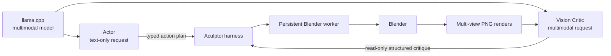

# Architecture

Aculptoi keeps orchestration separate from scene execution. The Actor and Vision Critic are separate roles even when they share a single multimodal provider, model endpoint, and set of weights.

| Component | Responsibility | May mutate Blender? |
| --- | --- | --- |
| CLI | User intent, configuration, stable JSON output | No |
| Harness | Bounded refinement state machine and artifact recording | Via worker only |
| Actor | Plans typed actions from goal, scene, critique, and iteration state; it is the bounded-reasoning role and requests are text-only by default | No |
| Blender client | Versioned local transport abstraction | Sends validated actions |
| Blender worker | Independently validates and performs V1 operations | Yes |
| Vision critic | Evaluates prepared PNG renders into structured, read-only feedback | No |
| Model provider | Reusable OpenAI-compatible endpoint client; may be selected by one or both roles | No |
| Checkpoint store | Writes inspectable metadata, captures failed model responses, and copies validated snapshots into run iterations | No scene mutation |

The HTTP transport is purposefully small and local-only in V1. A Unix socket or a headless batch transport can replace the client implementation without changing actor, critic, schemas, or loop semantics.

`[providers.<name>]` defines an endpoint once. `[actor]` and `[vision]` each select it by name. The default `local` provider is selected by both roles, so one llama.cpp multimodal server is enough. Selecting different provider names preserves the two-endpoint topology. Sharing a provider only shares its reusable HTTP client; it does not create shared conversation history, grant the critic mutation authority, or merge the role prompts or schemas.

The critic prepares PNG copies in memory and constrains their longest dimension before placing them in OpenAI-compatible image data URLs. Stored inspection renders remain the original worker outputs.

Each run begins with `user-prompt.txt`, containing the exact human goal. Each successful iteration has its own `iteration-XXX/` directory containing the Actor prompt and plan, action result, vision-request manifest, visual analysis, multi-view renders, checkpoint metadata, and a `scene.blend` copy. The central `.aculptoi/checkpoints/` location remains the recovery source used by `checkpoint restore`. On model-response parsing or schema failure, the corresponding iteration retains an error JSON artifact and raw response text for local debugging; that diagnostic data never gains execution authority.

`blender/aculptoi_worker.py` is standalone so it can execute inside Blender's Python environment without requiring the project's normal Python dependencies. It must remain an explicit-route, allowlisted server.
